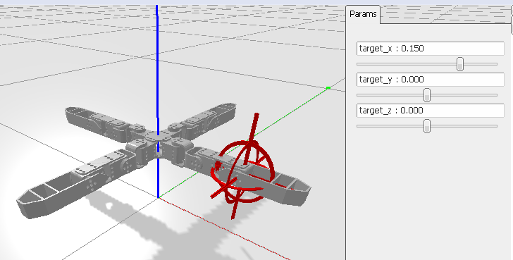

[&laquo; Retour](/quadruped/)

# Espace articulaire et espace opérationnel

Soit un robot à trois degrés de liberté:

<div class="text-center">

</div>

$$l_1 = 45 mm, l_2 = 65 mm, l_3 = 87 mm$$

* Les coordonnées $$(x, y, z)$$ du bout de la patte représentent **l'espace opérationnel**: celui dans lequel on
veut travailler
* Les coordonnées $$(\alpha, \beta, \gamma)$$ représentent **l'espace articulaire**: correspondant directement
aux degrés de liberté du robot (par construction)

<div class="alert alert-info">
    <b>Question</b>: comment passer d'un espace à un autre ?
</div>

* Passer de l'espace articulaire à l'espace opérationnel est ce qu'on appelle le **modèle géométrique direct** du robot,
* Passer de l'espace opérationnel à l'espace articulaire est le **modèle géométrique inverse**..

# Modèle géométrique direct

Le code suivant résout le problème du modèle direct. Il produit la position $$x$$, $$y$$, $$z$$ à partir des angles
moteurs:

```python
import math

# Dimensions (mm)
l1, l2, l3 = 45, 65, 87

def forward_kinematics(alpha, beta, gamma):
    """Prend en entrée les angles moteurs et produit la position atteinte"""
    xp = l1 + math.cos(beta)*l2 + math.cos(beta + gamma)*l3
    yp = math.sin(beta)*l2 + math.sin(beta + gamma)*l3
    
    x = math.cos(alpha) * xp 
    y = math.sin(alpha) * xp 
    z = yp
    
    return x, y, z
```

Adaptez ce code pour implémenter le mode `direct` du simulateur.

# Loi des cosinus

Dans un triangle **quelconque**, dont les côtés mesurent $$a$$, $$b$$ et $$c$$ et les angles sont $$\alpha$$, $$\beta$$
et $$\gamma$$, comme sur la figure suivante:

<div class="text-center">

</div>

Dans ce cas, on peut utiliser les égalités suivantes:

$$c^2 = a^2 + b^2 - 2ab cos \gamma$$

$$\gamma = arccos \frac{a^2 + b^2 - c^2}{2ab}$$

Autrement dit, à partir du moment ou trois des six valeurs ($$a$$, $$b$$, $$c$$, $$\alpha$$, $$\beta$$, $$\gamma$$) sont connues, il est possible de retrouver toutes les autres.
    
* [Article Wikipédia "Loi des cosinus"](https://fr.wikipedia.org/wiki/Loi_des_cosinus)

# Modèle géométrique inverse

Il faut maintenant résoudre le problème inverse de manière analytique. Nous le ferons ensemble pendant le cours
et donnerons une correction au tableau.

Ensuite, dans `control.py`, implémentez le code de la fonction `inverse`, de telle manière à pouvoir contrôler
le bout de la patte à l'aide des sliders lorsque vous lancez le programme avec.

```
python simulator.py -m inverse
```

La cible rouge indique la position cible. Si votre code fonctionne, le bout de la patte est donc supposé atteindre la cible.

<div class="text-center">

</div>

<hr/>

Dans la prochaine partie, nous implémenterons [l'interpolation linéaire](/quadruped/interpolation) permettant
de produire des ordres plus "lisses"
