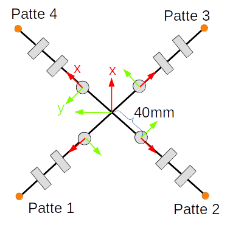

[&laquo; Retour](/quadruped/)

## Repère du robot

Vous savez à présent calculer les angles cibles pour les trois moteurs à partir d'une position cible donnée dans le repère de la patte.

Pour pouvoir contrôler les quatre pattes, nous allons avoir besoin de pouvoir travailler dans un système de coordonnée unique: le repère robot.

Chaque repère de patte (comme dans la séance [cinématique](/quadruped/kinematics)) est centré sur le premier moteur, orientée de telle manière que la patte longe l'axe $$x$$ lorsque les moteurs sont en position $$0$$, et l'axe $$z$$ est orienté vers le haut.

Le repère robot du simulateur est le suivant:

<div class="text-center">

</div>

Note: on introduit une nouvelle dimension ici ( $$40mm$$ ) qui sépare les pattes du centre.

## Rotation

<div class="text-center">

</div>

Si on rotate un point de coordonnées $$x, y$$ autour de l'origine de $$\alpha$$ radians (sens trigonométrique), les coordonnées $$x', y'$$ du point d'arrivée sont données par:

$$
x' = cos(\alpha) x - sin(\alpha) y \\
y' = sin(\alpha) x + cos(\alpha) y
$$

# Implémentation dans le projet

Dans `control.py`, implémentez maintenant la fonction `legs` de manière à pouvoir contrôler la position de toutes les pattes du robot à l'aide des sliders.

```
python simulator.py -m legs
```

Les cibles rouges sont les positions à atteindre. Si votre code fonctionne, le bout des pattes sera donc sur la cible rouge correspondante.

<div class="text-center">

</div>

<hr/>

Une fois terminé, vous pourrez combiner toutes les séances pour faire marcher votre robot et réaliser le
[rendu final](/quadruped/#rendu-final)